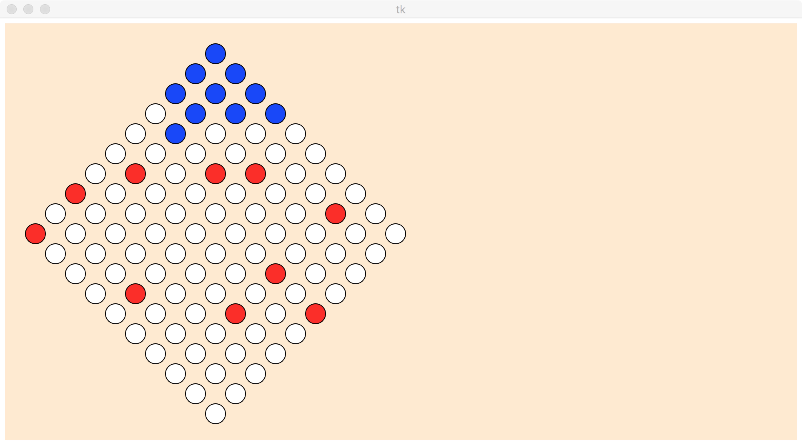

# ChineseCheckerAI
Course AU332 ChineseChecker AI homework. The game is performed by two agents but not human beings.

We use Minimax and alpha-beta pruning to make up the agent. However there are several questions and we use different methods to solve it well :

- Professor make the timeout function as 2 seconds, which means we have to find the solution within 2s. Obviously, it's seemingly and actually unachievable with too many layers. 
  But we use another method of pruning instead of ordinary alpha-beta, and refresh the best_action during the search and get a perfect result.
- Evaluation function is crucial to the agent. We use stepping as the measurement of so called "Bridging", distance to win as "wining rate" and looseness as the checkers' positions.
- Different state of the game needs different type of algorithms. Thus we use maximax at the very beginning of the game, Minimax as the battlefield function and Greedy as the end of the game. We even made a total situation of the latest game of the checker to ensure its performance.




In the file, ourAgent is the submitted agent that we use, lxdagent is another agent using minimax and alpha-beta pruning with simple evaluation function to test our agent. Agent.py consists of random agent, greedy agent and another better written minimax agent used to compete with us and get a better insight into our AI.

To play the AI game, please type

```
python3 runGame.py
```

which only satisfy the environment of Linux and Mac with Python 3.5.2